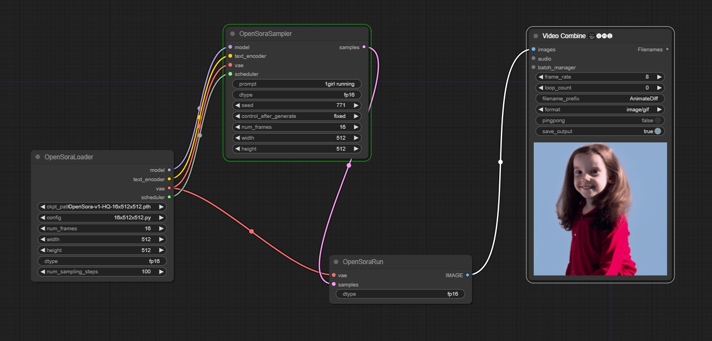

## ComfyUI-Open-Sora

```
pip install packaging ninja
pip install flash-attn --no-build-isolation

git clone https://www.github.com/nvidia/apex
cd apex
sudo python setup.py install --cuda_ext --cpp_ext

pip3 install -U xformers --index-url https://download.pytorch.org/whl/cu121

cd ComfyUI/custom_nodes
git clone https://github.com/chaojie/ComfyUI-Open-Sora
cd ComfyUI-Open-Sora
pip install -v .
```

## Models

download https://huggingface.co/hpcai-tech/Open-Sora/blob/main/OpenSora-v1-HQ-16x256x256.pth & put it to ComfyUI/models/checkpoints

| Resolution  | Data   | #iterations | Batch Size | GPU days (H800) | URL                                                                                           |
| ---------- | ------ | ----------- | ---------- | --------------- | --------------------------------------------------------------------------------------------- |
| 16×256×256 | 366K   | 80k         | 8×64       | 117             | [:link:](https://huggingface.co/hpcai-tech/Open-Sora/blob/main/OpenSora-v1-16x256x256.pth)    |
| 16×256×256 | 20K HQ | 24k         | 8×64       | 45              | [:link:](https://huggingface.co/hpcai-tech/Open-Sora/blob/main/OpenSora-v1-HQ-16x256x256.pth) |
| 16×512×512 | 20K HQ | 20k         | 2×64       | 35              | [:link:](https://huggingface.co/hpcai-tech/Open-Sora/blob/main/OpenSora-v1-HQ-16x512x512.pth) |


```
pip install -U huggingface_hub
中国用户可以执行这一步 export HF_ENDPOINT=https://hf-mirror.com  windows上在powershell里$env:HF_ENDPOINT = "https://hf-mirror.com"
huggingface-cli download --resume-download DeepFloyd/t5-v1_1-xxl
huggingface-cli download --resume-download stabilityai/sd-vae-ft-ema
```

## Examples

### base workflow



https://github.com/chaojie/ComfyUI-Oepn-Sora/blob/main/wf.json

[Open-Sora](https://github.com/hpcaitech/Open-Sora)